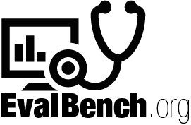

EvalBench - A Software Library for Visualization Evaluation
================================

EvalBench, an easy-to-use, flexible, and reusable software library written in 
Java that reliefs much of the burden of evaluation feature implementation from 
visualization developers and makes conducting user studies much easier. It can 
be used and integrated with third-party visualization prototypes that need to 
be evaluated via loose coupling. Further advantages are better reproducibility 
as well as the increased reliability and precision of built-in and automated 
evaluation features compared to external methods for measurement. EvalBench 
supports both, quantitative and qualitative evaluation methods such as 
controlled experiments, interaction logging, questionnaires, usability 
inspections, and insight diaries.

EvalBench is licensed under the terms of a BSD 2-clause license, and can be 
freely used for both commercial and non-commercial purposes (see LICENSE).

DEMO
----

The source of a demo application showing the library in use is included. 

To start the evaluation, select the "Evaluation" menu in the menu bar and 
select "Start evaluation".

The demo is also available as an 
[executable JAR file](http://www.ifs.tuwien.ac.at/~rind/preprint/EvalBenchDemo.zip) 
(unzip first).

STRUCTURE
---------

The library distribution uses the following organization:
<pre>
+ EvalBench
|-- lib                Third-party libraries needed by EvalBench
|-- evaluationJournal  Output files that arise during an evaluation
|-- src                The source code for the EvalBench library
|-- src_demo           The source code of demo applications showing the library in use
|-- xml                Example task lists and other data files
</pre>

REQUIREMENTS
------------

EvalBench is written in Java 1.6. To compile the EvalBench code, and to build 
and run evaluation systems, you'll need a copy of the Java Development Kit 
(JDK) for version 1.6 or greater. 

The library depends on the following packages: 
- Apache Commons Lang 3 classes: http://commons.apache.org/proper/commons-lang/
- Apache logging library log4j 1.2: http://logging.apache.org/log4j/1.2/
- JCalendar 1.4 by Kai Toedter: http://www.toedter.com/en/jcalendar/

We also recommended (though by no means is it required) that you use an
Integrated Development Environment such as Eclipse (http://eclipse.org).
Especially if you are a Java novice, it will likely make your life much easier.

Citation
--------

Wolfgang Aigner, Stephan Hoffmann, and Alexander Rind,   
EvalBench: A Software Library for Visualization Evaluation,   
_Computer Graphics Forum,_ vol. 32, no. 3, p. 41-50, 2013. 
PDF: http://publik.tuwien.ac.at/files/PubDat_217457.pdf
